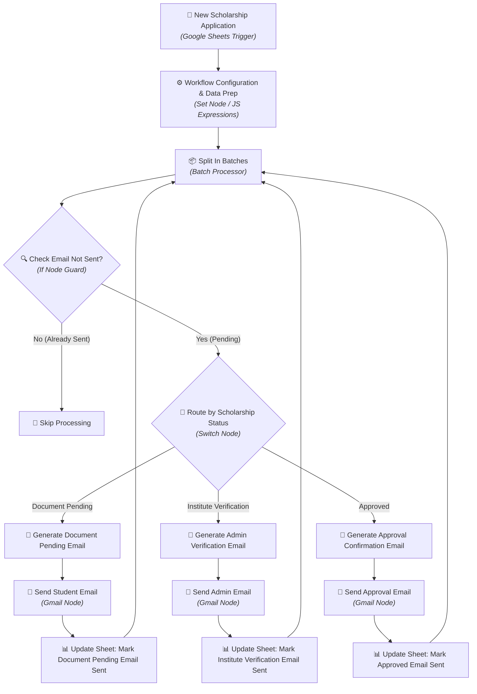
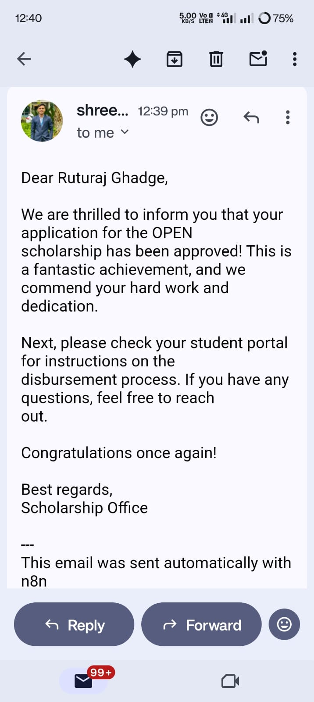
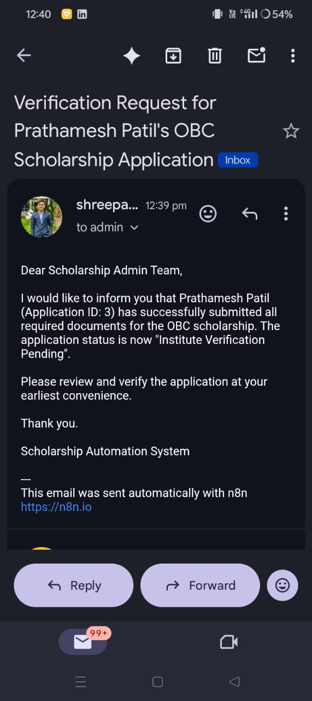

# 🎓 Scholarship Reminder Automation using n8n

[](https://n8n.io/)
[](https://developer.mozilla.org/en-US/docs/Web/JavaScript)
[](https://mail.google.com/)
[](https://workspace.google.com/products/sheets/)
[](https://restfulapi.net/)
[](https://n8n.io/)
[](LICENSE)

An intelligent, event-driven automation workflow engineered using **n8n** that streamlines scholarship tracking and reminder management for educational institutions. The system automatically fetches student application data from Google Sheets, evaluates eligibility and application status, dynamically generates personalized email reminders, and dispatches them via Gmail—eliminating manual follow-up inefficiencies.

---

## 📌 Problem Statement

Educational institutions process hundreds of government (e.g., Mahadbt) and private scholarship applications every academic year. Traditionally, staff manage these applications using manual tools like physical registers and detached Excel spreadsheets. 

This approach introduces significant operational flaws:
- ❌ **Tracking & Verification Errors**: High human error rates in manually identifying missing documents or pending actions.
- ❌ **Missed Deadlines**: Students fail to upload mandatory documents in time due to a lack of structured reminders.
- ❌ **Excessive Administrative Burden**: College staff spend hundreds of hours manually drafting and sending individual follow-up emails.
- ❌ **Lack of Centralized Status Transparency**: Neither students nor administrators have real-time visibility into application progress.

---

## 💡 Solution & Project Overview

The **Scholarship Reminder Automation System** solves this challenge by introducing an automated workflow built on **n8n**. It acts as a bridge between **Google Sheets** (the application data repository) and **Gmail** (the communication engine). 

When a new application row is logged or updated:
1. The **n8n Google Sheets Trigger** listens for updates in real time.
2. The workflow cleans and normalizes student payload records using **JavaScript expression nodes**.
3. Applications pass through an **Anti-Duplication Guard** and are processed sequentially in batches.
4. A **Dynamic Switch Router** evaluates application status (`Document Pending`, `Institute Verification Required`, `Approved`).
5. Tailored, personalized emails are dispatched to students or administrators via **Gmail OAuth2**.
6. The workflow updates status flags directly back in Google Sheets to prevent duplicate reminders.

---

## ✨ Features

- ⚡ **Real-Time Data Triggers**: Instantaneous workflow activation upon row insertions or updates in Google Sheets.
- 🧠 **Intelligent Status Routing**: Conditional multi-branch logic (`Switch` node) routing records based on current application stage.
- ✉️ **Dynamic Personalized Communications**: Automatic crafting and sending of customized emails tailored to missing documents or approval details.
- 🔁 **State Tracking & Duplication Protection**: Validates email delivery status before executing nodes to ensure zero spam or duplicate sends.
- 📦 **Batch Processing Scalability**: Utilizes `Split In Batches` nodes to process hundreds of student records efficiently without hitting API rate limits.
- 🏢 **Multi-Role Notification System**: Directs administrative alerts to college officers and student action notices directly to candidates.

---

## 🏗️ Workflow Architecture

The flowchart below visualizes the node-by-node execution lifecycle within n8n:



---

## 🔁 Workflow Step-by-Step Explanation

```
 ┌───────────────────────┐      ┌───────────────────────┐      ┌───────────────────────┐
 │ 1. Trigger & Ingest   │ ───► │ 2. Clean & Normalize  │ ───► │ 3. Guard & Batch      │
 └───────────────────────┘      └───────────────────────┘      └───────────────────────┘
                                                                           │
 ┌───────────────────────┐      ┌───────────────────────┐                  ▼
 │ 6. Update Datastore   │ ◄─── │ 5. Dispatch Email     │ ◄─── ┌───────────────────────┐
 └───────────────────────┘      └───────────────────────┘      │ 4. Conditional Switch │
                                                               └───────────────────────┘
```

1. **Step 1: Real-Time Event Triggering (`Google Sheets Trigger`)**
   - Monitors the connected Google Sheet (`Scholarship Application Responses`) for new entries or status updates.

2. **Step 2: Payload Data Preparation (`Set Node / JavaScript`)**
   - Normalizes student details including Student Name, Email Address, Application ID, Scholarship Type, Missing Documents, and Current Status.

3. **Step 3: Anti-Duplication & Batch Allocation (`If` Node & `Split In Batches`)**
   - Verifies whether a reminder email has already been dispatched for the target application state.
   - Splits dataset items into batches to maintain queue control and avoid API rate limits.

4. **Step 4: Dynamic Status Routing (`Switch` Node)**
   - Routes execution into three distinct pathways:
     - **Branch 1 (`Document Pending`)**: Triggered when student records require additional document uploads.
     - **Branch 2 (`Institute Verification Required`)**: Triggered when college administration needs to verify submitted credentials.
     - **Branch 3 (`Approved`)**: Triggered upon successful scholarship authorization.

5. **Step 5: Automated Email Dispatch (`Gmail Node`)**
   - Sends customized email templates containing specific action links, deadline warnings, or approval confirmations using Gmail OAuth2 integration.

6. **Step 6: Real-Time State Sync (`Google Sheets Node`)**
   - Locates the corresponding row (`Find Row` operation) and updates state variables to `Email Sent = TRUE`, providing complete tracking transparency.

---

## 🛠️ Technologies Used

| Technology | Purpose in Project |
| :--- | :--- |
| **[n8n](https://n8n.io/)** | Primary workflow automation engine orchestrating triggers, logic nodes, and API calls. |
| **[Gmail](https://mail.google.com/)** | Email service handling authenticated OAuth2 dispatch of automated student/admin notices. |
| **[Google Sheets](https://workspace.google.com/products/sheets/)** | Cloud datastore storing student applications, statuses, and reminder execution flags. |
| **[JavaScript (ES6+)](https://developer.mozilla.org/en-US/docs/Web/JavaScript)** | Used within n8n code and set nodes for custom payload transformation and conditional evaluation. |
| **Webhooks** | Event-driven HTTP mechanisms facilitating instant communication between components. |
| **REST APIs** | Underlying HTTP endpoints used for communication with Google Workspace services. |

---

## 📂 Repository Structure

```
Scholarship-Application/
├── 📁 docs/
│   ├── design.md                            # Detailed System Architecture & Design Specification
│   └── requirements.md                      # Functional & Non-Functional Project Requirements
├── 📁 screenshots/
│   ├── n8n_workflow_canvas.jpeg             # Full Canvas Overview of the n8n Workflow
│   ├── workflow_execution_nodes.jpeg        # Detailed Node Pipeline View
│   └── email_notification_log.jpeg          # Email Execution & Log Output
├── 📄 final 2 routes copy copy (1).json     # Complete Exported n8n Workflow JSON
├── 📄 design.md                             # Root Copy of Design Document
├── 📄 requirements.md                       # Root Copy of Requirements Document
└── 📄 README.md                             # Project Documentation & Guide
```

---

## 📸 Screenshots & Workflow Preview

### 🖼️ n8n Automation Workflow Canvas


### 🖼️ Execution Pipeline & Switch Routing


---

## 🚀 Installation & Setup Guide

### Prerequisites
- An active [n8n](https://n8n.io/) instance (Cloud or Self-Hosted via Docker/npm).
- A Google Cloud Platform account with **Google Sheets API** and **Gmail API** enabled.
- OAuth2 credentials configured for Google Workspace inside n8n.

### Step-by-Step Setup

1. **Clone the Repository**
   ```bash
   git clone https://github.com/Shree0802/Scholarship-Application.git
   cd Scholarship-Application
   ```

2. **Import Workflow into n8n**
   - Open your n8n dashboard.
   - Click on **Workflows** > **Import from File**.
   - Select `final 2 routes copy copy (1).json` from the repository root.

3. **Configure Credentials**
   - **Google Sheets Trigger**: Connect your Google OAuth2 API account and set your Google Sheet Document ID.
   - **Gmail Account**: Authenticate your Gmail OAuth2 credentials for sending emails.

4. **Activate the Workflow**
   - Toggle the workflow state from `Inactive` to `Active` in the upper-right corner of your n8n interface.

---

## 📖 Usage Instructions

1. **Add Student Record**: Submit or insert a student row into the linked Google Sheet (e.g., via Google Form).
2. **Workflow Execution**: The n8n trigger detects the new row automatically.
3. **Automated Notification**: 
   - If documents are missing, the student receives a personalized reminder email.
   - If verification is needed, an administrator receives a verification request.
   - If approved, the student receives an approval notice.
4. **Audit Trail**: Check the Google Sheet to view updated status flags (`Email Sent: Yes`).

---

## 🔮 Future Enhancements

- 📱 **WhatsApp & SMS Integration**: Incorporate WhatsApp Business API (via Meta/Twilio) for multi-channel deadline alerts.
- 🌐 **Multi-Language Support**: Support dynamic localized email generation (English, Marathi, Hindi) for diverse student demographics.
- 📊 **Real-Time Analytics Dashboard**: Build a web dashboard showing real-time delivery stats, open rates, and pending verification counts.
- 🔍 **AI Document Validation**: Integrate OCR (Optical Character Recognition) to automatically verify document uploads prior to updating statuses.

---

## 👤 Author

**Shree Patil**
- 🐙 GitHub: [@Shree0802](https://github.com/Shree0802)
- 📧 Email: [shreepatil0802@gmail.com](mailto:shreepatil0802@gmail.com)
- 🔗 Live n8n Cloud Workflow: [View Workflow on n8n Cloud](https://prathameshpatil41.app.n8n.cloud/workflow/HDv4Hy3HLM1qUHkw)

---

## 📜 License

This project is licensed under the [MIT License](LICENSE) - feel free to use and adapt it for academic or commercial automation purposes.
